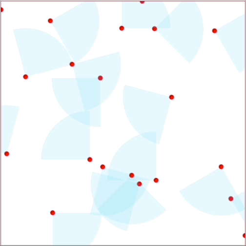

# RLanimals

Reinforcement Learning simulator in Rust.
A simple predator-and-prey simulator where herbivores eat plants and carnivores
eats herbivores.

## Goals

- [ ] Reinforcement learning for beasts
- [x] Concurrent threads for each beast
- [ ] A simple web-based GUI

## The journey

Brief documentation of what has been achieved and how the code works.

### Beasts

Beast is the parent trait of herbivores and carnivores and containts the 
functions and structs common for both classes of animal.

Beasts can inherently:

- See with varying FOV
- Eat
- Die

Beasts can do discrete actions:

- Set speed
- Move foreward
- Turn left
- Turn right
- Reverse at reduced speed

To goal of a beast is to survive and reproduce by eating food. When enough food
is eaten, they spawn a child with a slight random modification in physical
traits. This will allow for benifical traits to live on, and detremental traits
will die out.

#### Herbivores

Herbivores wants to eat grass and does not want to starve or get eaten by
carnivores.

#### Carnivores

Carnivores want to eat herbivores and avoid starving to death.

### Concurrency

Every beast runs on a thread which is working concurrently. To be able to update
the world state, message passing is used towards the main theard, ~~and the beasts
reads the world from an Atomic Reference Counted (ARC) vector.~~ ARC abanonded
due to difficuly to share across threads, message passing is used both ways now.

### Web based GUI

